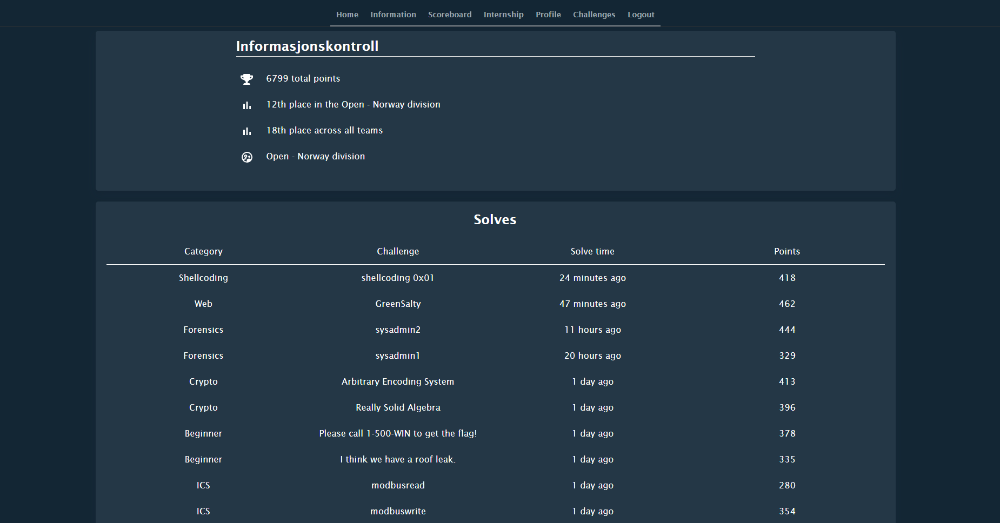
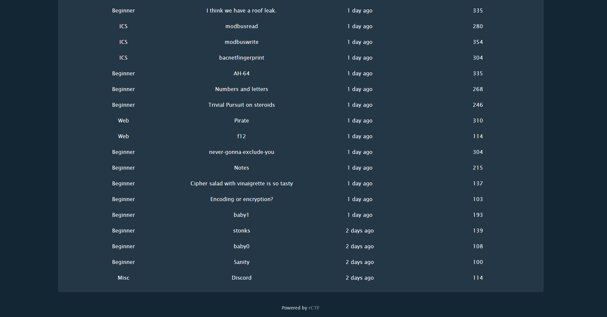

# Equinor CTF 2021
> 2021-10-29

---

## Writeups

These are my writeups from the CTF:

- [Crypto/Arbitrary Encoding System](crypto/arbitrary-encoding-system)
- [Crypto/Really Solid Algebra](crypto/really-solid-algebra)
- [Shellcoding/shellcoding 0x01](shellcoding/0x01)
- [Web/GreenSalty](web/green-salty)
- [Web/Notes](web/notes)

More writeups from the team `Informasjonskontroll` may be available here later: https://github.com/informasjonskontroll.

---

## Summary

